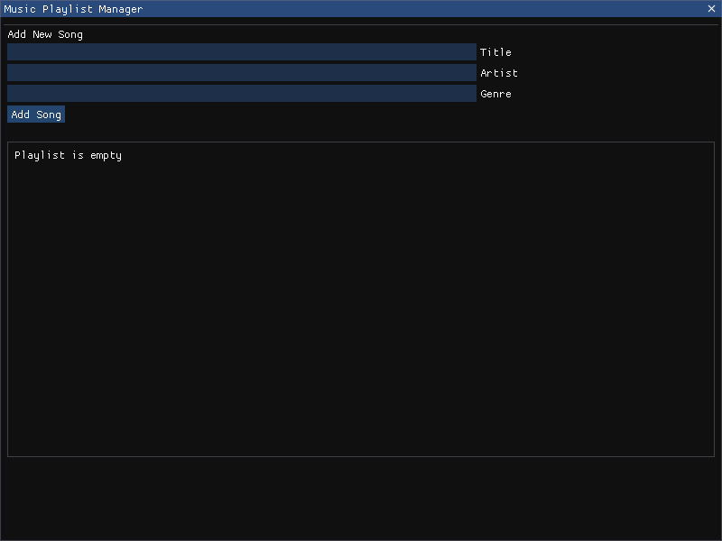

# Music Playlist Manager

A simple GUI application for managing music playlists built with Python and ImGui. This application allows users to add, delete, and modify songs in a playlist with a clean and intuitive interface.

## Features

- Add songs with title, artist, and genre information
- View all songs in a scrollable playlist
- Right-click context menu for editing and deleting songs
- Drag-and-drop window movement
- Error handling and input validation
- Clean modern interface

## Requirements

- Python 3.6+
- OpenGL
- GLFW
- ImGui

## Installation

1. Clone the repository:
```bash
git clone https://github.com/ben-westwood/Music-Playlist-Manager.git
cd Music-Playlist-Manager
```

2. Install the required dependencies:
```bash
pip install -r requirements.txt
```

## Usage

Run the application using Python:
```bash
python music_playlist_manager.py
```

### Basic Operations

- **Add a Song**: Fill in the title, artist, and genre fields at the top and click "Add Song"
- **Edit a Song**: Right-click on any song in the playlist to open the context menu
- **Delete a Song**: Use the delete option in the right-click context menu
- **Move Window**: Click and drag the title bar to move the application window

## Screenshots

### Main Interface


*The main application window showing the playlist manager interface*

### Adding a Song


*Example of adding a new song to the playlist*

### Context Menu


*Right-click context menu for song management*

## License

This project is licensed under the GNU General Public License v3.0 - see the [LICENSE](LICENSE) file for details.
